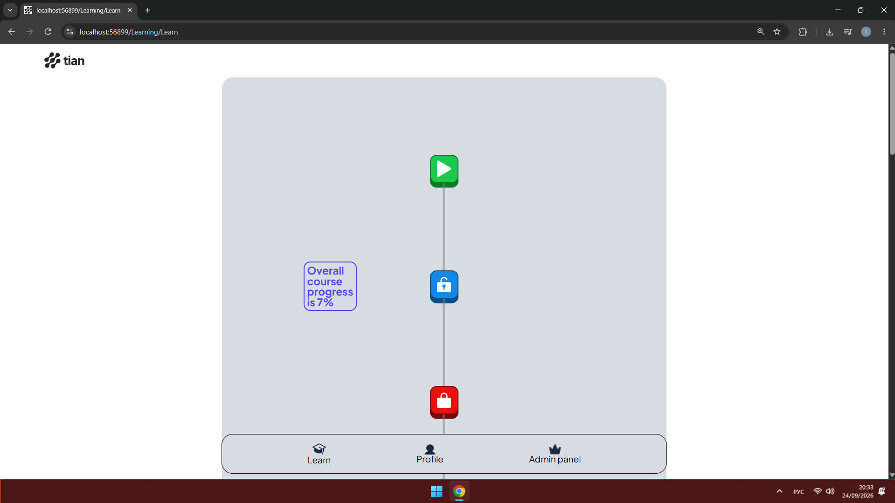
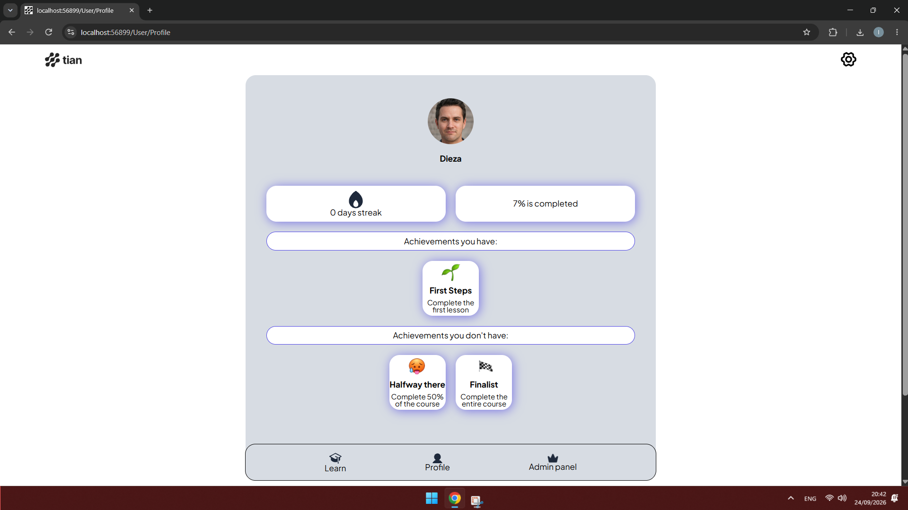

# tian - Python Learning Platform

## Note

The project is no longer maintained.

## Description

This web application is intended to teach absolute beginners Python programming in an engaging and interactive manner. With step-by-step lessons, quizzes, and hands-on practice, users will be able to master Python fundamentals and begin coding with confidence.

## **Demonstration video**

**Link to the demonstration video: 
https://www.youtube.com/watch?v=9IbWCHOr5sM**

## Screenshots

## Main Features

- **Account system:** Users can create an account by entering their email address and password. They can also make changes to their account information, such as their profile picture and username.

- **Lessons:** The study program is made up of lessons. Each lesson lasts about 3 to 10 minutes and includes a variety of slides. There's a theory slide with text and an image, a question slide with four answer options, and a coding question slide with an embedded code editor.

- **System administration:** A user with the role of administrator can create and delete slides and lessons. Additionally, users can be created, deleted, and edited. All of this is done on specific pages that require administrator privileges.

- **Achievement system:** users can earn achievements, such as "First Steps" when they complete their first lesson. This system encourages the user to test his limits and progress in his studies. The achievements can be viewed on the profile page.

## Main Tech Used

- ASP.NET Core
- HTML
- CSS
- Java Script (JS)

## Installation

This section shows how to run the web app locally on your computer.

### Video Guide

This video is very detailed so you get fewer problems: [video link]

### Text Guide

1. Install [Visual Studio](https://visualstudio.microsoft.com).
2. In the Visual Studio Installer, select the ".NET desktop development" and "ASP.NET and web development" workloads.
3. Install [Microsoft SQL Server](https://www.microsoft.com/en-us/sql-server).
4. Select the "Basic" installation type and follow the prompts to complete the installation.
5. Install the two databases from here: [Link to Drive](https://drive.google.com/drive/folders/1xLLMWMRSm_MfHhAakuFg92R1WldMh8mq?usp=sharing).
6. Install [SQL Server Management Studio](https://learn.microsoft.com/en-us/ssms/install/install).
7. Open SQL Server Management Studio on your computer.
8. Click File → Connect Object Explorer.
9. Enter `localhost` as the name of the server.
10. Tick the Trust Server Certificate checkbox.
11. Click Connect.
12. In the Object Explorer, click on the SQL Server instance to expand it.
13. Right-click on the Databases folder and select Import Data-tier Application.
14. Click Next on the Introduction screen.
15. Click Browse and select the `AppDb.bacpac`.
16. Click Next and then click Finish to start the import process.
17. Repeat the process for the second database.
18. Open Visual Studio and click Clone a repository.
19. Enter the following URL in the Repository location field: [https://github.com/Diezaaa/tian.git](https://github.com/Diezaaa/tian.git).
20. Click Clone to download the repository to your local machine.
21. If prompted in the Solution Explorer that the project is targeting a different version of .NET, click Yes to retarget the project to the installed version of .NET.
22. Click on the "Run" button to start the application.
23. You can use the following credentials to log in:

    - **Admin:**
      - Username: `Dieza`
      - Password: `1234567DAniel_`

    - **Regular user:**
      - Username: `CoolJohn123`
      - Password: `1234567JOhn_`

## Important Point About Architecture

The app uses the MVC architecture pattern.
